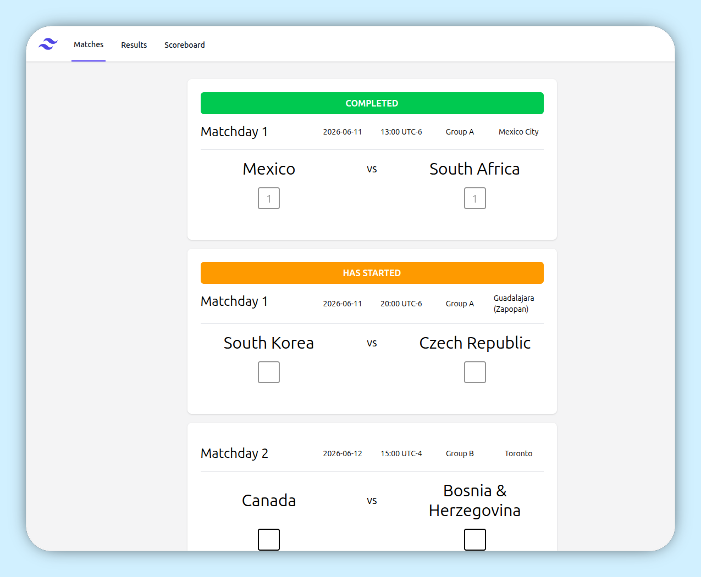
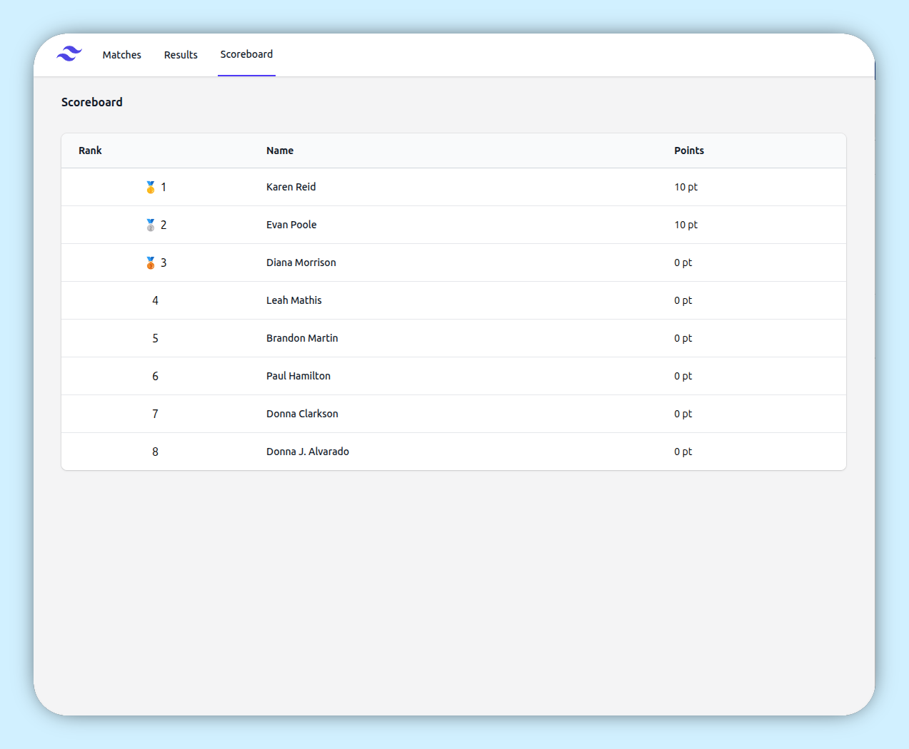

# World Cup Predictor

A simple World Cup prediction application built with Spring Boot, Gradle, Thymeleaf, and Spring Security.

Users can create match predictions, compete on a leaderboard, and compare their scores with other participants.

## Screenshots

Where you make your match predictions.



Compare each other on your predictions.



## Features

* User registration and login
* Match prediction management
* Automatic point calculation
* Leaderboard and rankings
* Admin-only result management
* Docker and Docker Compose support

## Requirements

* Java 21+
* Docker (optional)
* Docker Compose (optional)

## Development

Start the application locally:

```bash
./gradlew bootRun
```

Run tests:

```bash
./gradlew test
```

Build the application:

```bash
./gradlew build
```

The application will be available at:

```
http://localhost:8080
```

## Docker

Build the image:

```bash
docker build -t world-cup .
```

Run the image:

```bash
docker run -p 8080:8080 world-cup
```

## Docker Compose

Start the application:

```bash
docker compose up -d
```

Stop the application:

```bash
docker compose down
```

## Container Registry

Pre-built images are available through GitHub Container Registry:

```bash
docker pull ghcr.io/james-code-creator/world_cup:latest
```

Specific versions can be pulled using:

```bash
docker pull ghcr.io/james-code-creator/world_cup:<tag>
```

Available images and tags can be found in the GitHub Packages section of this repository.

## Configuration

Application configuration is provided through Spring Boot configuration files and environment variables.

Settings include:

| Variable        | Description                  |
|-----------------|------------------------------|
| ADMIN_USERNAME  | The user who can set results |
| DB_PATH         | SQLite Path                  |

Or in application.properties

- `app.admin.username=${ADMIN_USERNAME:admin}`
- `spring.datasource.url=jdbc:sqlite:${DB_PATH:./mydb.db}`

## Security

Authentication is session-based using Spring Security.

Administrative functionality such as entering match results is restricted to users with the `ADMIN` role.

## License

This project is provided as-is.
